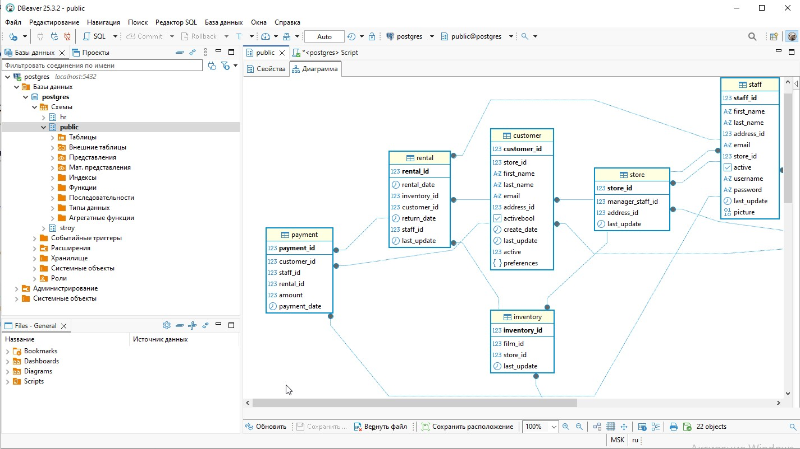
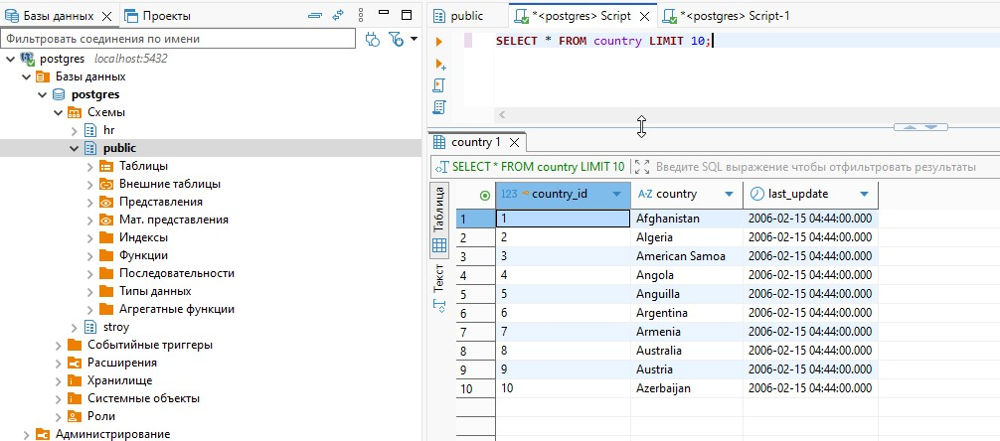

# **Домашнее задание по теме «Введение в SQL и установка ПО»**
## Цель домашнего задания:
- научиться настраивать подключение к базе данных
- научиться формировать ER-диаграмму таблиц базы данных
- закрепить знания по определению первичных ключей для таблиц
- написать и выполнить первый SQL-запрос
 

# **Основная часть:**
## Задание 1. 
Создайте новое соединение в DBeaver и подключите облачную или локальную базу данных с учебными базами данных dvd-rental и hr согласно инструкции. Сделайте скриншот результата (список подключений с раскрытыми схемами)


## Задание 2. 
Откройте ER-диаграмму таблиц учебной базы данных dvd-rental. Сделайте скриншот результата.

```
см. скриншот с задание 1
```

## Задание 3. 
Перечислите все 15 таблиц учебной базы данных dvd-rental и столбцы, которые имеют ограничения первичных ключей для этих таблиц. Решение предполагает выполнение в любом текстовом или табличном редакторе, где нужно сформировать таблицу из 2х столбцов: название таблицы, название столбцов.
```
actor		actor_id
address		address_id
category	category_id
city		city_id
country		country_id
customer	customer_id
film		film_id
film_actor	actor_id film_id
film_category	film_id category_id
inventory	inventory_id
language	language_id
payment		payment_id
rental		rental_id
staff		staff_id
store		store_id

```

## Задание 4. 
Выполните SQL-запрос к учебной базе данных dvd-rental “SELECT * FROM country LIMIT 10;”. Сделайте скриншот результата.



#**Дополнительная часть:**
## Задание 1. 
С помощью SQL-запроса выведите в результат таблицу, содержащую названия таблиц и названия ограничений первичных ключей в этих таблицах учебной базы dvd-rental. В результат нужно вывести все столбцы. Для написания запроса используйте представление information_schema.table_constraints.

## Задание 2. 
С помощью SQL-запроса выведите в результат таблицу, содержащую названия таблиц и названия ограничений внешних ключей в этих таблицах учебной базы hr. В результат нужно вывести два столбца: название таблицы и название ограничения. Для написания запроса используйте представление information_schema.table_constraints.
